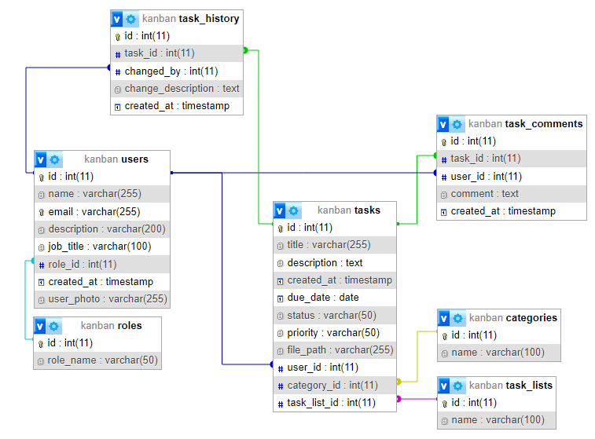

# Task Management App (Mini Trello)


Este é um aplicativo de gerenciamento de tarefas simples, inspirado no Trello, que permite criar, editar e organizar tarefas. Os usuários podem ser responsáveis por tarefas, adicionar categorias/tags, organizar tarefas em listas (como "para fazer", "em progresso", "concluído") e fazer upload de arquivos. Cada usuário tem um papel no sistema, como Admin ou Usuário comum.

## Funcionalidades
- **Gerenciamento de Tarefas**: Criação, edição e organização de tarefas.
- **Atribuição de Responsáveis**: Cada tarefa pode ter um usuário responsável.
- **Categorias e Tags**: Tarefas podem ser categorizadas e etiquetadas.
- **Listas de Tarefas**: As tarefas podem ser movidas entre diferentes listas (ex. "para fazer", "em progresso", "concluído").
- **Upload de Arquivos**: As tarefas podem incluir arquivos anexos.
- **Comentários**: Os usuários podem adicionar comentários às tarefas.
- **Histórico**: Mudanças nas tarefas são registradas no histórico.
## Tecnologias Utilizadas
- **Node.js** com **Express.js** para o servidor backend.
- **MySQL** para o banco de dados relacional.
- **Multer** para upload de arquivos.
- **Swagger** para a documentação da API.
- **CORS** para permitir requisições de diferentes origens.
- **StandardJS** como estilo de código.
## Estrutura de Pastas
```bach
/public
/src
├── config/           # Configurações (incluindo Multer para upload)
├── controllers/      # Lógica de negócios
├── helpers/          # Funções auxiliares (ex: tratamento de erros específicos)
├── middlewares/      # Manipulação de erros e middlewares
├── models/           # Modelos de dados (MySQL queries)
├── routes/           # Definições de rotas
├── swagger/          # Arquivos de configuração Swagger
├── uploads/          # Imagens, documentos ou audios 
└── app.js            # Arquivo principal do servidor
```
## Como Clonar e Configurar o Projeto
### Passo 1: Clonar o Repositório
```bach
git clone https://github.com/devHyrum/kanban-backend-project-toti
cd kanban-backend-project-toti
```
### Passo 2: Instalar as Dependências
Certifique-se de ter o Node.js e MySQL instalados. Para instalar as dependências do Node.js, execute:
```bach
npm install
```
### Passo 3: Configurar o Banco de Dados
- Crie um banco de dados MySQL chamado ``Kanban``.
- Importe o arquivo SQL fornecido para criar as tabelas necessárias e inserir dados iniciais.
### Passo 4: Criar um arquivo ``.env``
Crie um arquivo ``.env`` na raiz do projeto e adicione as variáveis de ambiente necessárias, como as credenciais do banco de dados:
```makefile
DB_HOST=localhost
DB_USER=seu_usuario
DB_PASSWORD=sua_senha
DB_DATABASE=task_management
```
### Passo 5: Iniciar o Servidor
Inicie o servidor localmente:
```bach
npm run dev
```
O aplicativo estará rodando em ``http://localhost:3000``.
### Passo 6: Acessar a Documentação da API
Após iniciar o servidor, você pode acessar a documentação da API gerada pelo Swagger em:
```bash
http://localhost:3000/api-docs
```
## Trabalhando no Projeto

### Acessar sua branch específica
Cada um de vocês tem uma branch designada. Use o comando abaixo para mudar para a sua branch.

#### Companheiro 1 - José
```bash
git checkout jose
```
#### Companheiro 2 - Hyrum
```bash
git checkout hyrum
```
### Sincronizar as alterações
Sempre que quiser sincronizar suas alterações com o repositório remoto, siga os passos abaixo:

1. Primeiro, adicione os arquivos modificados:
```bash
git add .
```
2. Faça o commit das suas alterações:
```bash
git commit -m "Descrição das alterações"
```
3. Envie suas alterações para a branch remota:
```bash
git push origin sua-branch
```
Substitua `sua-branch` pelo nome da sua branch (ex.: `jose`, `hyrum`).

### Para verificar em qual branch você está
Você pode verificar a branch atual a qualquer momento com o comando:
```bash
git branch
```
### Atualizar a branch com as mudanças do repositório remoto
Sempre que quiser garantir que sua branch está atualizada com as últimas alterações do repositório remoto, execute:
```bash
git pull origin sua-branch
```
Substitua `sua-branch` pelo nome da sua branch.

